# CRUD Estudiantes - Backend

API REST desarrollada con **NestJS, TypeScript, TypeORM y SQL Server** para la gestión de estudiantes, usuarios, cursos, catedráticos y asignaciones académicas.

El backend implementa autenticación mediante **JWT**, autorización basada en roles y diferentes endpoints para la administración de la información utilizada por el frontend desarrollado en Angular.

---

## Tecnologías utilizadas

- NestJS
- TypeScript
- TypeORM
- SQL Server
- JSON Web Token (JWT)
- pnpm
- Git / GitHub

---

## Requisitos previos

Antes de ejecutar el proyecto es necesario tener instalado:

- Node.js
- pnpm
- SQL Server
- Git

Opcionalmente, se puede utilizar alguna herramienta para administrar SQL Server:

- SQL Server Management Studio (SSMS)
- DBeaver

---

# Instalación y ejecución

## 1. Clonar el repositorio

Clonar el proyecto desde GitHub:

```bash
git clone https://github.com/iJosxh/CRUD-Estudiantes.git
```

Ingresar a la carpeta del proyecto:

```bash
cd CRUD-Estudiantes-Backend
```

Luego a:

```bash
cd backend
```

---

## 2. Instalar las dependencias

El proyecto utiliza **pnpm** como administrador de paquetes.

Ejecutar:

```bash
pnpm install
```

Esto instalará todas las dependencias definidas en `package.json`.

---

# Configuración de variables de entorno

El repositorio contiene un archivo:

```text
.env.example
```

Este archivo sirve como plantilla para configurar las variables de entorno necesarias para ejecutar el proyecto.

Después de clonar el repositorio, se debe crear una copia de `.env.example` y nombrarla:

```text
.env
```

También se puede copiar y renombrar manualmente.

La estructura del archivo es similar a:

```env
DB_HOST=localhost
DB_PORT=1433
DB_USERNAME=TU_USUARIO
DB_PASSWORD=TU_PASSWORD
DB_DATABASE=crudestudiantes

JWT_SECRET=TU_CLAVE_SECRETA
```

Se deben reemplazar los valores de ejemplo con la configuración correspondiente de SQL Server.

---

# Configuración de la base de datos

El proyecto utiliza **Microsoft SQL Server**.

Dentro del repositorio se encuentra el archivo:

```text
database/crud_estudiantes.sql
```

Este script contiene la creación y población inicial de la base de datos.


# Ejecutar el backend

Una vez instaladas las dependencias, configurada la base de datos y creado el archivo `.env`, ejecutar:

```bash
pnpm run start:dev
```

NestJS iniciará el servidor en modo desarrollo.

Por defecto, la API estará disponible en:

```text
http://localhost:3000
```

---

# Endpoints de la API

## Autenticación

### Iniciar sesión

```http
POST /auth/login
```

Permite autenticar un usuario mediante su nombre de usuario y contraseña.

---

# Usuarios

## Crear usuario

```http
POST /usuarios
```

Permite registrar un nuevo usuario en el sistema.

---

## Listar usuarios

```http
GET /usuarios
```

Obtiene los usuarios registrados en el sistema.

---

## Usuarios disponibles para estudiantes

```http
GET /usuarios/disponibles-estudiantes
```

Obtiene únicamente los usuarios que pueden ser asociados a un nuevo estudiante.

El endpoint filtra usuarios que:

- Tienen rol `Estudiante`.
- Se encuentran en estado `Activo`.
- Todavía no tienen un estudiante asociado.

---

# Estudiantes

## Crear estudiante

```http
POST /estudiantes
```

Permite registrar un nuevo estudiante.

---

## Listar estudiantes

```http
GET /estudiantes
```

Obtiene la lista de estudiantes junto con la información relacionada necesaria para el sistema.

---

## Obtener estudiante por ID

```http
GET /estudiantes/:id
```

Obtiene la información correspondiente al estudiante indicado.

---

## Actualizar estudiante

```http
PATCH /estudiantes/:id
```

Permite modificar la información de un estudiante existente.

---

## Eliminar estudiante

```http
DELETE /estudiantes/:id
```

La eliminación de estudiantes se realiza mediante **borrado lógico**.

---

# Catedráticos

## Crear catedrático

```http
POST /catedraticos
```

Permite registrar un nuevo catedrático.

---

## Listar catedráticos

```http
GET /catedraticos
```

Obtiene los catedráticos registrados.

---

# Cursos

## Crear curso

```http
POST /cursos
```

Permite registrar un nuevo curso.

---

## Listar cursos

```http
GET /cursos
```

Obtiene la lista de cursos registrados junto con sus relaciones correspondientes.

---

# Asignaciones de cursos

## Asignar curso a estudiante

```http
POST /asignaciones
```

Permite asignar un curso a un estudiante.

---

## Listar asignaciones

```http
GET /asignaciones
```

Obtiene las asignaciones de cursos registradas.

---

## Consultar cursos del estudiante autenticado

```http
GET /asignaciones/mis-cursos
```

Permite que un usuario con rol `Estudiante` consulte los cursos que tiene asignados.

---

# Catálogos

Los catálogos almacenados en SQL Server son utilizados para evitar valores escritos directamente en el código y para cargar las opciones de los formularios del frontend.

## Niveles

```http
GET /catalogos/niveles
```

---

## Estados

```http
GET /catalogos/estados
```

Obtiene los estados disponibles, como:

- Activo
- Inactivo

---

## Grados

```http
GET /catalogos/grados
```

Obtiene los grados registrados en el catálogo.

---

## Carreras

```http
GET /catalogos/carreras
```

Obtiene las carreras registradas en el catálogo.

---

## Roles

```http
GET /catalogos/roles
```

Obtiene los roles disponibles en el sistema.

Por ejemplo:

- Administrador
- Estudiante

Los endpoints de catálogos son utilizados principalmente por el frontend para cargar elementos `<select>`. El frontend muestra el `nombre` al usuario y utiliza internamente `idCatalogoDetalle` para enviar la información al backend.

---

# Evidencias y ejemplos de uso

A continuación se presentan capturas de las pruebas realizadas a los diferentes endpoints de la API utilizando **Postman**.

## Estudiantes

### Crear estudiante - POST

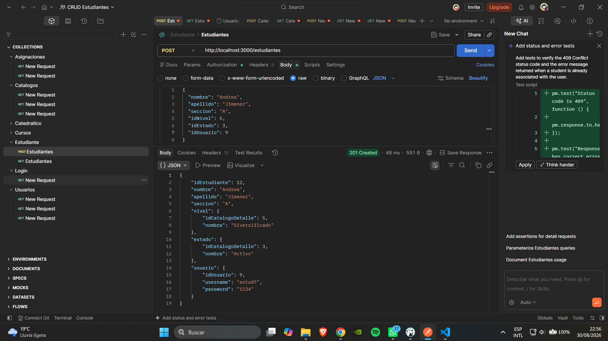

### Listar estudiantes - GET

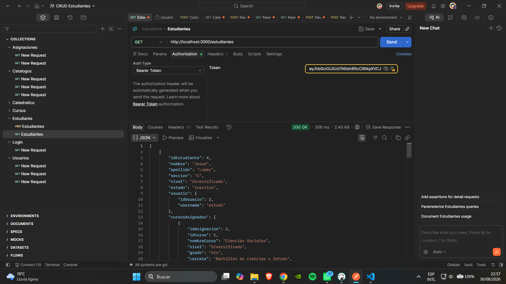

### Obtener estudiante por ID - GET

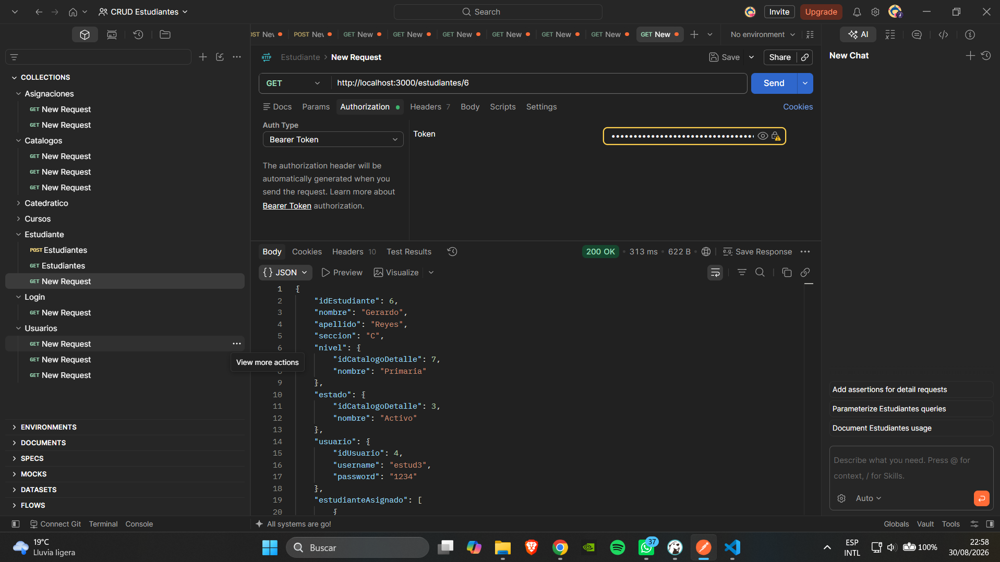

### Actualizar estudiante - PATCH

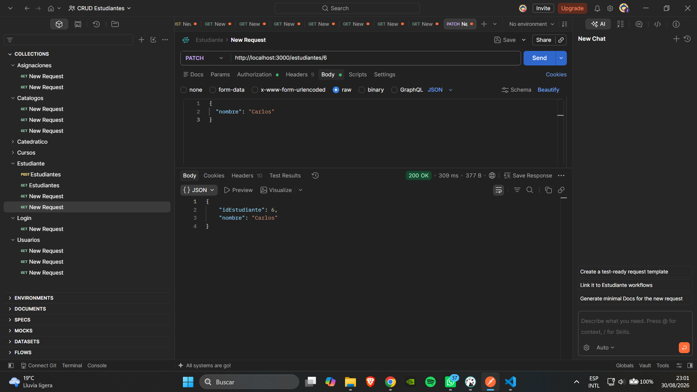

---

## Cursos

### Crear curso - POST

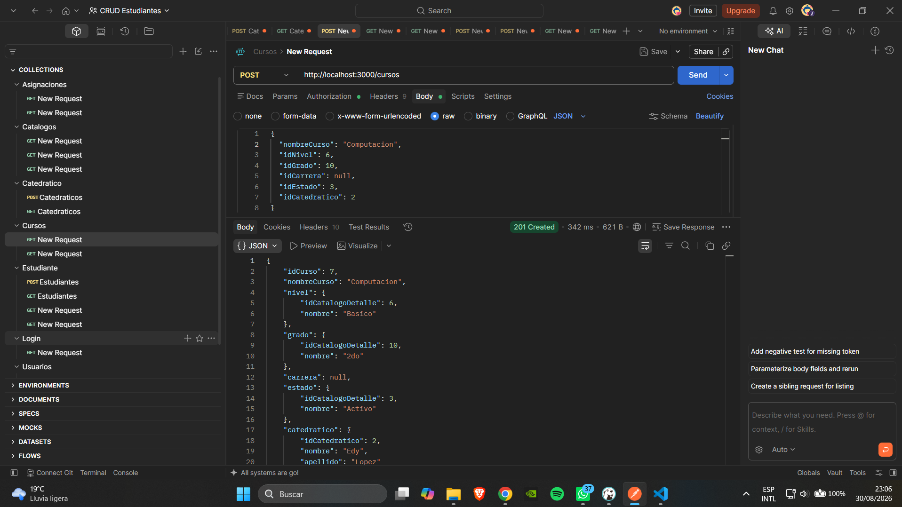

### Listar cursos - GET

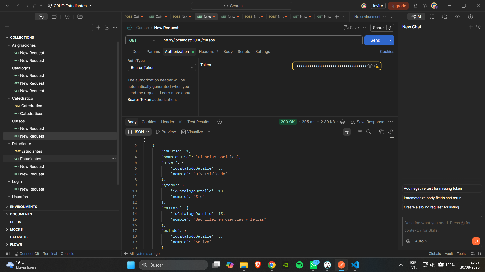

---

## Catedráticos

### Crear catedrático - POST

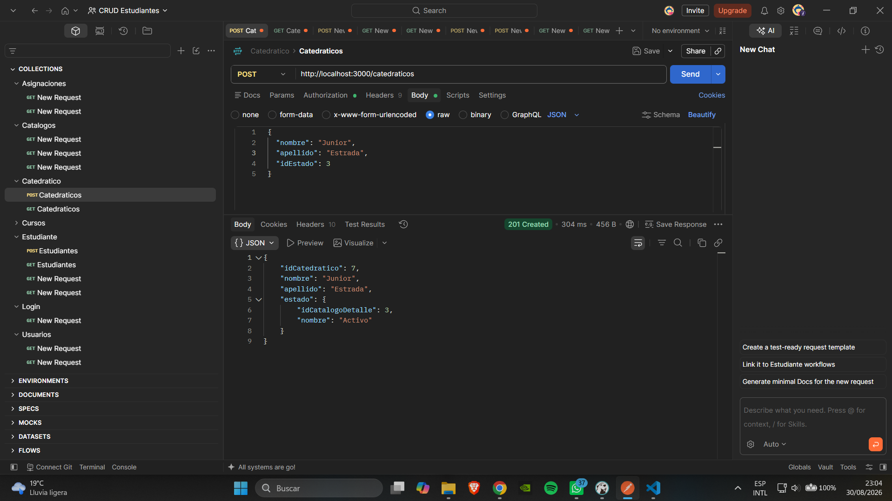

### Listar catedráticos - GET

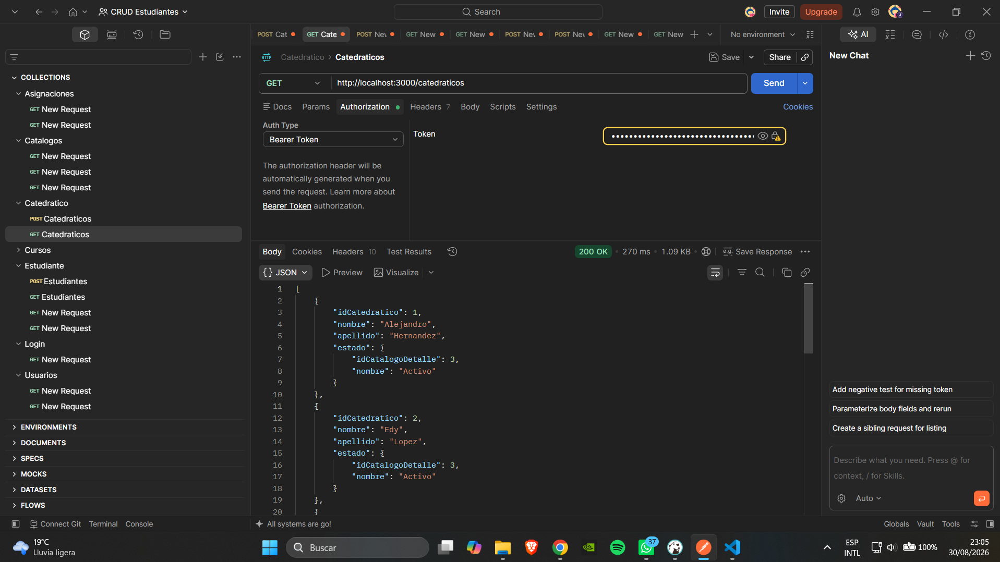

---

## Asignaciones

### Asignar curso a estudiante - POST

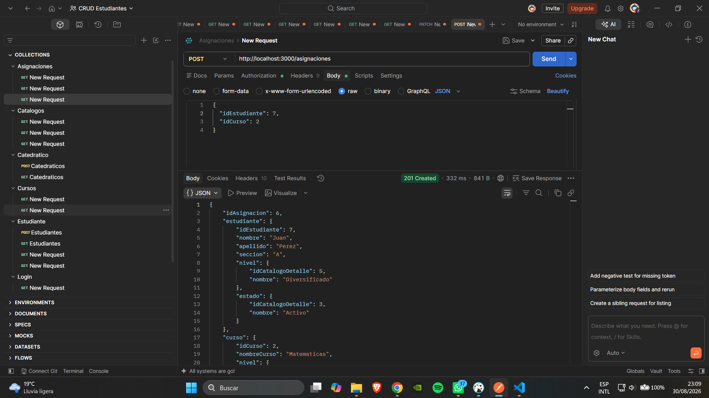

### Listar asignaciones - GET

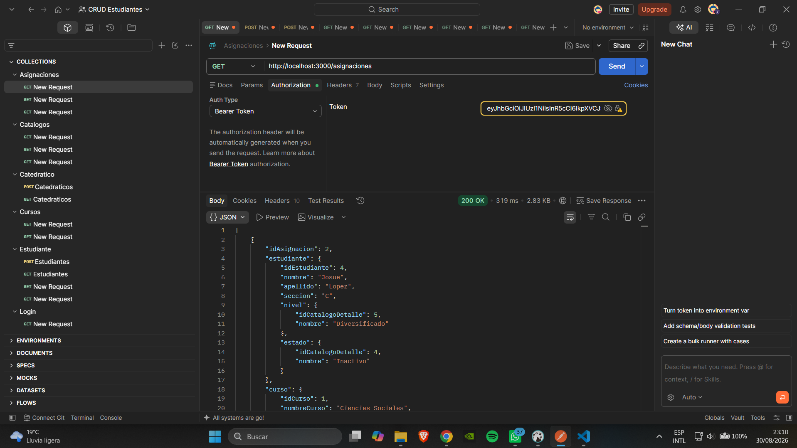

### Consultar cursos asignados a un estudiante - GET

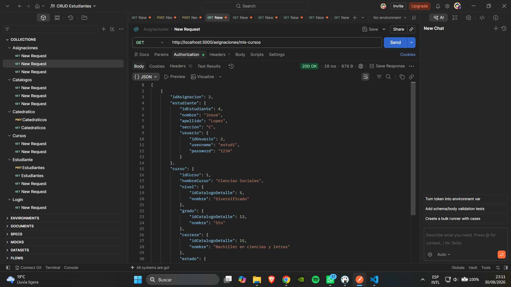

---

## Usuarios

### Listar usuarios - GET

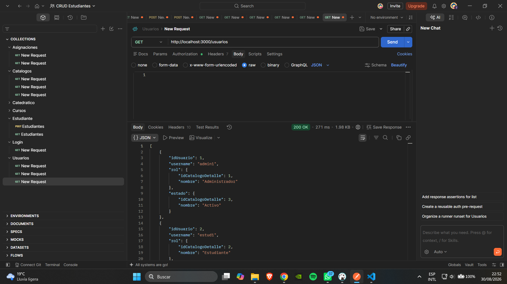

### Listar usuarios disponibles para estudiantes - GET

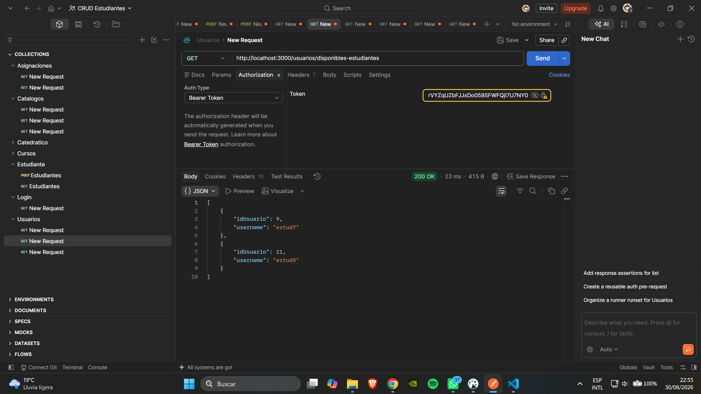

---

## Catálogos

Los siguientes endpoints permiten consultar la información de los catálogos utilizada por el sistema y por los elementos `select` del frontend.

### Niveles - GET

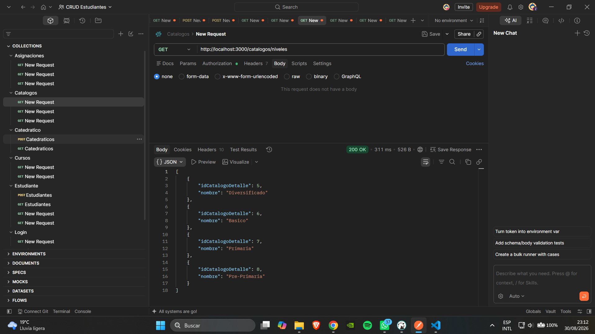

### Estados - GET

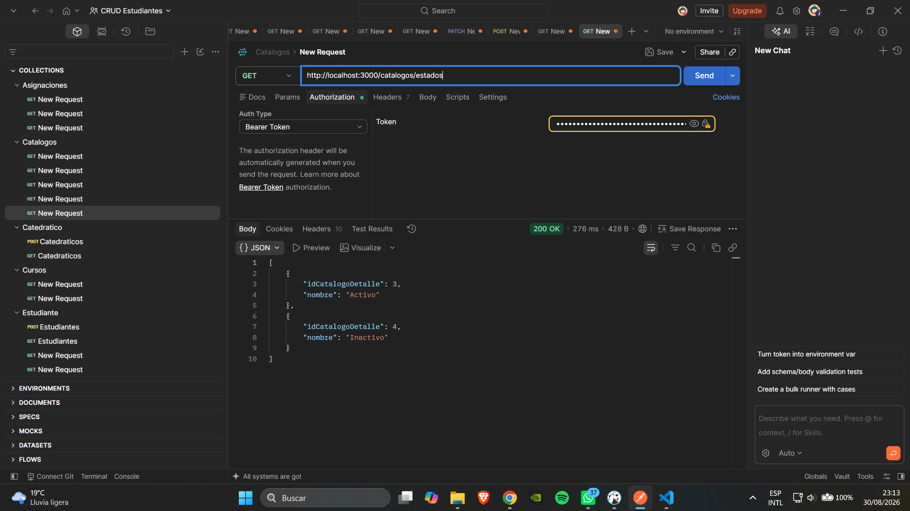

### Grados - GET

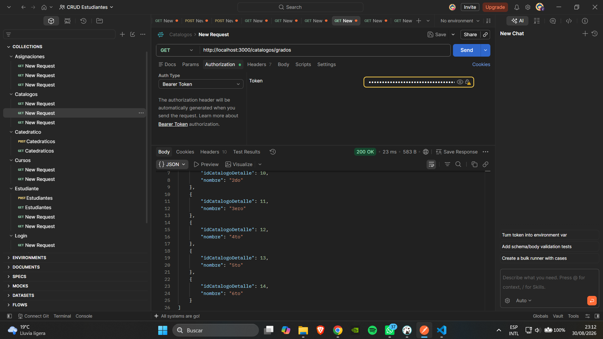

### Carreras - GET

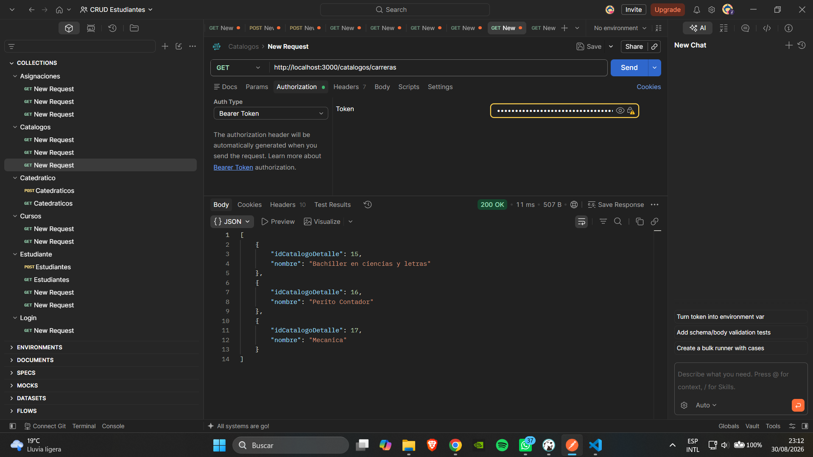

### Roles - GET

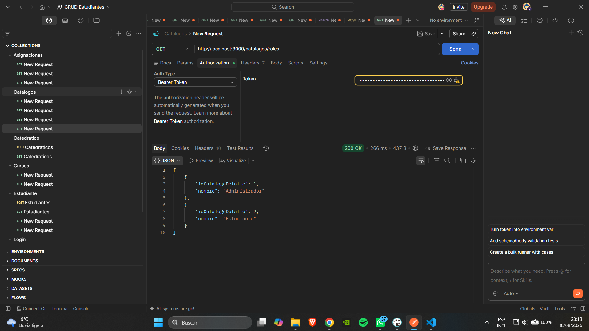

---

# Autor

```text
https://github.com/iJosxh
```